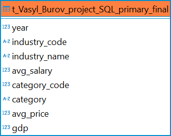
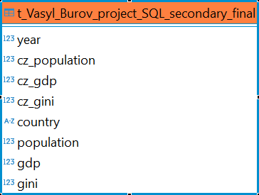

# Projekt z SQL

> Na vašem analytickém oddělení nezávislé společnosti, která se zabývá životní úrovní občanů, jste se dohodli, že se pokusíte odpovědět na pár definovaných výzkumných otázek, které adresují **dostupnost základních potravin široké veřejnosti**. Kolegové již vydefinovali základní otázky, na které se pokusí odpovědět a poskytnout tuto informaci tiskovému oddělení. Toto oddělení bude výsledky prezentovat na následující konferenci zaměřené na tuto oblast.

> Potřebují k tomu **od vás připravit robustní datové podklady**, ve kterých bude možné vidět **porovnání dostupnosti potravin na základě průměrných příjmů za určité časové období**.

> Jako dodatečný materiál připravte i tabulku s HDP, GINI koeficientem a populací **dalších evropských států** ve stejném období, jako primární přehled pro ČR.

> Pomozte kolegům s daným úkolem. Výstupem by měly být dvě tabulky v databázi, ze kterých se požadovaná data dají získat. Tabulky pojmenujte `t_{jmeno}_{prijmeni}_project_SQL_primary_final` (pro data mezd a cen potravin za Českou republiku sjednocených na totožné porovnatelné období – společné roky) a `t_{jmeno}_{prijmeni}_project_SQL_secondary_final` (pro dodatečná data o dalších evropských státech).

> Dále připravte sadu SQL, které z vámi připravených tabulek získají datový podklad k odpovězení na vytyčené výzkumné otázky. Pozor, otázky/hypotézy mohou vaše výstupy podporovat i vyvracet! Záleží na tom, co říkají data.

> Na svém GitHub účtu vytvořte repozitář (může být soukromý), kam uložíte všechny informace k projektu – hlavně SQL skript generující výslednou tabulku, popis mezivýsledků (průvodní listinu) a informace o výstupních datech (například kde chybí hodnoty apod.).

## t_Vasyl_Burov_project_SQL_primary_final.sql
Data mezd a cen potravin za Českou republiku sjednocených na totožné porovnatelné období – společné roky.



Pro vytvoření primární tabulky bylo potřeba zjistit společné roky dat o příjmech a cenách potravin. Zde je pomocný skript pro zjištění tohoto období:

```
WITH payroll_yrs AS (
    SELECT 
        MIN(payroll_year) AS min_year, 
        MAX(payroll_year) AS max_year
    FROM czechia_payroll
),
price_yrs AS (
    SELECT 
        MIN(YEAR(date_from)) AS min_year, 
        MAX(YEAR(date_from)) AS max_year
    FROM czechia_price
)
SELECT 
    GREATEST(pay.min_year, price.min_year) AS common_min_year,
    LEAST(pay.max_year, price.max_year) AS common_max_year
FROM payroll_yrs pay
JOIN price_yrs price;
```

## t_Vasyl_Burov_project_SQL_secondary_final.sql
Dodatečná data o dalších evropských státech.[^1]



## 1_wage_trends.sql
> 1. Rostou v průběhu let mzdy ve všech odvětvích, nebo v některých klesají?

|industry_code|industry_name                                               |up_years|down_years|
|-------------|------------------------------------------------------------|--------|----------|
|C            |Zpracovatelský průmysl                                      |12      |0         |
|H            |Doprava a skladování                                        |12      |0         |
|Q            |Zdravotní a sociální péče                                   |12      |0         |
|S            |Ostatní činnosti                                            |12      |0         |
|A            |Zemědělství, lesnictví, rybářství                           |11      |1         |
|E            |Zásobování vodou; činnosti související s odpady a sanacemi  |11      |1         |
|F            |Stavebnictví                                                |11      |1         |
|G            |Velkoobchod a maloobchod; opravy a údržba motorových vozidel|11      |1         |
|J            |Informační a komunikační činnosti                           |11      |1         |
|K            |Peněžnictví a pojišťovnictví                                |11      |1         |
|L            |Činnosti v oblasti nemovitostí                              |11      |1         |
|N            |Administrativní a podpůrné činnosti                         |11      |1         |
|P            |Vzdělávání                                                  |11      |1         |
|D            |Výroba a rozvod elektřiny, plynu, tepla a klimatiz. vzduchu |10      |2         |
|I            |Ubytování, stravování a pohostinství                        |10      |2         |
|M            |Profesní, vědecké a technické činnosti                      |10      |2         |
|O            |Veřejná správa a obrana; povinné sociální zabezpečení       |10      |2         |
|R            |Kulturní, zábavní a rekreační činnosti                      |10      |2         |
|B            |Těžba a dobývání                                            |8       |4         |

## 2_milk_bread_comparison.sql
> 2. Kolik je možné si koupit litrů mléka a kilogramů chleba za první a poslední srovnatelné období v dostupných datech cen a mezd?

|year |avg_salary|category_code|category                   |avg_price|affordability|
|-----|----------|-------------|---------------------------|---------|-------------|
|2,006|20,754    |111,301      |Chléb konzumní kmínový     |16.12    |1,287        |
|2,006|20,754    |114,201      |Mléko polotučné pasterované|14.44    |1,437        |
|2,018|32,536    |111,301      |Chléb konzumní kmínový     |24.24    |1,342        |
|2,018|32,536    |114,201      |Mléko polotučné pasterované|19.82    |1,642        |

## 3_slowest_price_increase.sql
> 3. Která kategorie potravin zdražuje nejpomaleji (je u ní nejnižší percentuální meziroční nárůst)?

|category_code|category                        |price_2006|price_2018|percent_yoy|
|-------------|--------------------------------|----------|----------|-----------|
|118,101      |Cukr krystalový                 |21.73     |15.75     |-2.29      |
|117,101      |Rajská jablka červená kulatá    |57.83     |44.49     |-1.92      |
|116,103      |Banány žluté                    |27.3      |29.32     |0.62       |
|112,201      |Vepřová pečeně s kostí          |105.18    |116.85    |0.92       |
|122,102      |Přírodní minerální voda uhličitá|7.69      |8.64      |1.03       |
|111,303      |Pečivo pšeničné bílé            |38.6      |43.84     |1.13       |
|116,104      |Jablka konzumní                 |30.71     |36.17     |1.48       |
|112,704      |Šunkový salám                   |116.77    |144.88    |2.01       |
|117,401      |Konzumní brambory               |12.07     |15.08     |2.08       |
|114,501      |Eidamská cihla                  |110.95    |142.45    |2.37       |
|112,101      |Hovězí maso zadní bez kosti     |166.34    |223.26    |2.85       |
|2,000,001    |Kapr živý                       |69.35     |93.46     |2.9        |
|114,201      |Mléko polotučné pasterované     |14.44     |19.82     |3.1        |
|213,201      |Pivo výčepní, světlé, lahvové   |8.45      |11.81     |3.31       |
|115,201      |Rostlinný roztíratelný tuk      |69.45     |99.4      |3.59       |
|112,401      |Kuřata kuchaná celá             |47.47     |69.31     |3.83       |
|116,101      |Pomeranče                       |24.73     |36.5      |3.97       |
|111,301      |Chléb konzumní kmínový          |16.12     |24.24     |4.2        |
|111,201      |Pšeničná mouka hladká           |7.41      |11.44     |4.53       |
|117,106      |Mrkev                           |14.41     |22.45     |4.65       |
|114,401      |Jogurt bílý netučný             |5.83      |9.17      |4.77       |
|114,701      |Vejce slepičí čerstvá           |23.49     |38.39     |5.29       |
|111,101      |Rýže loupaná dlouhozrnná        |21.29     |36.18     |5.83       |
|117,103      |Papriky                         |35.31     |60.47     |5.94       |
|111,602      |Těstoviny vaječné               |26.1      |47.87     |6.95       |
|115,101      |Máslo                           |104.39    |207.08    |8.2        |

## 4_price_vs_wage_spike.sql
> 4. Existuje rok, ve kterém byl meziroční nárůst cen potravin výrazně vyšší než růst mezd (větší než 10 %)?

|year |salary|salary_change_pcent|price|price_change_pcent|delta|
|-----|------|-------------------|-----|------------------|-----|
|2,013|26,103|-1.6               |57   |5.1               |6.7  |
|2,012|26,516|3                  |54   |6.7               |3.7  |
|2,017|30,231|6.3                |62   |9.6               |3.3  |
|2,011|25,736|2.3                |51   |3.4               |1.1  |
|2,007|22,173|6.8                |49   |6.8               |0    |
|2,010|25,156|2                  |49   |1.9               |-0.1 |
|2,008|23,918|7.9                |52   |6.2               |-1.7 |
|2,014|26,771|2.6                |57   |0.7               |-1.9 |
|2,015|27,443|2.5                |57   |-0.6              |-3.1 |
|2,016|28,444|3.6                |56   |-1.2              |-4.8 |
|2,018|32,536|7.6                |63   |2.2               |-5.4 |
|2,009|24,674|3.2                |48   |-6.4              |-9.6 |
|2,006|20,754|                   |46   |                  |     |

## 5_gdp_effect.sql
> 5. Má výška HDP vliv na změny ve mzdách a cenách potravin? Neboli, pokud HDP vzroste výrazněji v jednom roce, projeví se to na cenách potravin či mzdách ve stejném nebo násdujícím roce výraznějším růstem?

|year |gdp            |gdp_change_pcent|salary|salary_change_pcent|price|price_change_pcent|
|-----|---------------|----------------|------|-------------------|-----|------------------|
|2,007|208,469,898,851|5.6             |22,173|6.8                |49   |6.8               |
|2,015|227,381,745,549|5.4             |27,443|2.5                |57   |-0.6              |
|2,017|245,202,003,266|5.2             |30,231|6.3                |62   |9.6               |
|2,009|204,100,298,391|-4.7            |24,674|3.2                |48   |-6.4              |
|2,018|253,045,172,104|3.2             |32,536|7.6                |63   |2.2               |
|2,008|214,070,259,128|2.7             |23,918|7.9                |52   |6.2               |
|2,016|233,151,067,381|2.5             |28,444|3.6                |56   |-1.2              |
|2,010|209,069,940,963|2.4             |25,156|2                  |49   |1.9               |
|2,014|215,755,991,069|2.3             |26,771|2.6                |57   |0.7               |
|2,011|212,750,323,791|1.8             |25,736|2.3                |51   |3.4               |
|2,012|211,080,224,603|-0.8            |26,516|3                  |54   |6.7               |
|2,013|210,983,331,026|0               |26,103|-1.6               |57   |5.1               |
|2,006|197,470,142,754|                |20,754|                   |46   |                  |

* year - Kalendářní rok, ke kterému se data vztahují.
* gdp - Hrubý domácí produkt; celková hodnota ekonomického výkonu.
* gdp_change_pcent - Meziroční procentuální změna HDP.
* salary - Průměrná roční mzda v zemi.
* salary_change_pcent - Meziroční procentuální změna průměrné mzdy.
* price - Průměrná cena potravin.
* price_change_pcent - Meziroční procentuální změna cen potravin.
  
[^1]: Pochopil jsem "jako primární přehled pro ČR" tak, že mám do každého řádku přidat sloupce s daty pro Českou republiku, aby moji kolegové mohli snadno porovnávat data evropských zemí s ČR.
